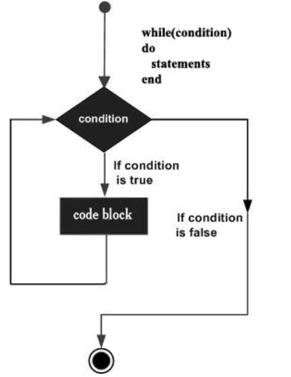
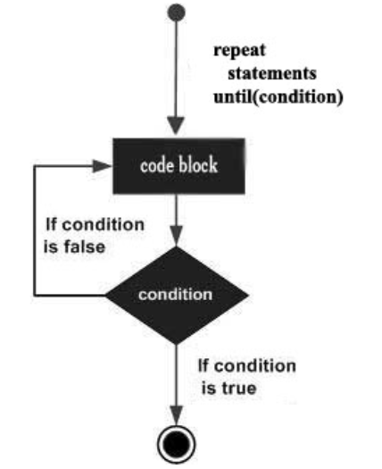
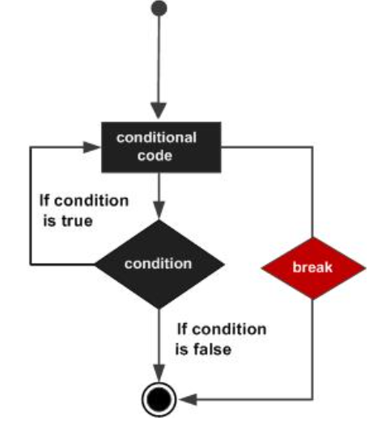
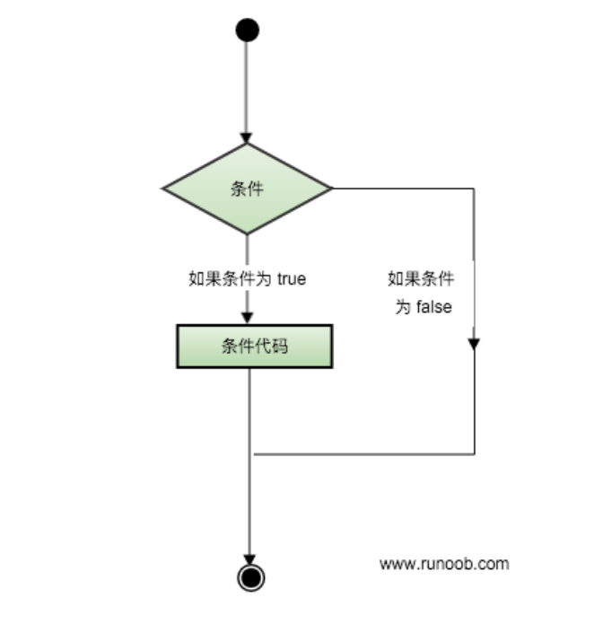
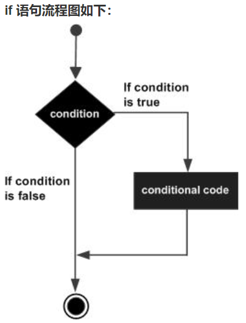
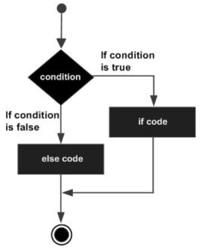

# Lua-Study
Learn Lua language routines.


## Linux Environment Configuration

```shell
1.Unzip the source code package and enter the directory。
2.make linux test
3.sudo make install
```


## Lua Basic Grammar

### Interactive Programming

```lua
$ lua
Lua 5.4.6  Copyright (C) 1994-2023 Lua.org, PUC-Rio
> print("hello world")
hello world
```


### Scripted Programming

```lua
#!/usr/local/bin/lua

print("hello Lua")
print("https://github.com/bhrbhr123")
```


result:

```shell
$ chmod u+x 2script.lua 
$ ls
1hello.lua  2script.lua
$ ./2script.lua 
hello Lua
https://github.com/bhrbhr123
```


### Comment

Single line comments

```lua
-- Single line comments
```


Multi-line comments

```lua
--[[
	Multi-line comments
	Multi-line comments
--]]
```


### Identifier

Lua identifiers are used to define a variable and functions to obtain other user-defined items. An identifier starts with one of the letters A to Z or a to z or an underscore _ followed by 0 or more letters, underscores, and numbers (0 to 9).

It is best not to use underscores and capital letters as identifiers, because this is also the case with Lua's reserved words.

Lua does not allow special characters such as @, $, and % to be used to define identifiers. Lua is a case-sensitive programming language. Therefore Runoob and runoob are two different identifiers in Lua.


### Key Words

Lua's reserved keywords are listed below. Reserved keywords cannot be used as constants or variables or other user-defined identifiers：

| and      | break | do    | else   |
| -------- | ----- | ----- | ------ |
| elseif   | end   | false | for    |
| function | if    | in    | local  |
| nil      | not   | or    | repeat |
| return   | then  | true  | until  |
| while    | goto  |       |        |

By general convention, names starting with an underscore followed by a string of uppercase letters (such as _VERSION) are reserved for Lua internal global variables.


### Global Variables

By default, variables are always considered global.

Global variables do not need to be declared. After assigning a value to a variable, the global variable is created. There is no error when accessing an uninitialized global variable, but the result is: nil.

```lua
-- nil
print(val)

-- 10
val = 10
print(val)
```


If you want to delete a global variable, just assign the variable to nil.

```lua
val = 10

print(val)


val = nil

-- A variable exists if and only if it is not equal to nil.
print(val)

```

This way the variable b acts as if it has never been used. In other words, a variable exists if and only if it is not equal to nil.


## Lua Type Of Data

Lua is a dynamically typed language. Variables do not need to be typed, only variables need to be assigned values. Values can be stored in variables, passed as arguments or returned as results.

There are 8 basic types in Lua: nil, boolean, number, string, userdata, function, thread and table.

| 数据类型 | 描述                                                         |
| :------- | :----------------------------------------------------------- |
| nil      | 这个最简单，只有值nil属于该类，表示一个无效值（在条件表达式中相当于false）。 |
| boolean  | 包含两个值：false和true。                                    |
| number   | 表示双精度类型的实浮点数                                     |
| string   | 字符串由一对双引号或单引号来表示                             |
| function | 由 C 或 Lua 编写的函数                                       |
| userdata | 表示任意存储在变量中的C数据结构                              |
| thread   | 表示执行的独立线路，用于执行协同程序                         |
| table    | Lua 中的表（table）其实是一个"关联数组"（associative arrays），数组的索引可以是数字、字符串或表类型。在 Lua 里，table 的创建是通过"构造表达式"来完成，最简单构造表达式是{}，用来创建一个空表。 |

We can use the type function to test the type of a given variable or value:

```lua
print(type(nil))

print(type(ture))
print(type(false))

print(type(10.66))

print(type('hello'))
print(type("world"))

print(type(type))

result:
$ lua 1type.lua 
nil
nil
boolean
number
string
string
function
```


### nil

The nil type represents a type that does not have any valid value. It has only one value - nil. For example, printing a variable without an assignment will output a nil value:

```lua
> print(type(a))
nil
>
```

For global variables and tables, nil also has a "deletion" effect. Assigning a nil value to global variables or variables in the table is equivalent to deleting them. You can know by executing the following code:

```lua
tab1 = { key1 = "val1", key2 = "val2", "val3" }
for k, v in pairs(tab1) do
    print(k .. " - " .. v)
end
 
tab1.key1 = nil
for k, v in pairs(tab1) do
    print(k .. " - " .. v)
end
```

nil should be compared with double quotes ":

```lua
> type(X)
nil
> type(X)==nil
false
> type(X)=="nil"
true
>
```

The reason why the result of type(X)==nil is false is that type(X) is essentially the returned "nil" string, which is a string type:

```lua
type(type(X))==string
```


### boolean

The boolean type has only two optional values: true (true) and false (false). Lua treats false and nil as false, everything else is true, and the number 0 is also true:

```lua
print(type(true))
print(type(false))
print(type(nil))
 
if false or nil then
    print("至少有一个是 true")
else
    print("false 和 nil 都为 false")
end

if 0 then
    print("数字 0 是 true")
else
    print("数字 0 为 false")
end
```


result:

```shell
$ lua 2boolean.lua 
nil
boolean
nil
都为false
0为ture
```


### number

Lua has only one number type by default - double (double precision) type (the default type can be modified in luaconf.h). The following writing methods are regarded as number types:

```lua
print(type(2))
print(type(2.2))
print(type(0.2))
print(type(2e+1))
print(type(0.2e-1))
print(type(7.8263692594256e-06))
```


result:

```shell
$ lua 3number.lua 
number
number
number
number
number
number
```


### string

A string is represented by a pair of double quotes or single quotes.

```lua
string1 = "this is string1"
string2 = 'this is string2'
```

You can also use 2 square brackets "[[]]" to represent a "block" of strings.

```lua
str1 = 'study Lua'
str2 = "study Lua"

html = [[
<html>
<head></head>
<body>
    <a href="http://www.runoob.com/">菜鸟教程</a>
</body>
</html>
]]
print(html)
print(str1)
print(str2)
```


result:

```shell
$ lua 4string.lua 
<html>
<head></head>
<body>
    <a href="http://www.runoob.com/">菜鸟教程</a>
</body>
</html>

study Lua
study Lua
```


When performing arithmetic operations on a numeric string, Lua will try to convert the numeric string into a number:

```lua
print("9" + 1)
print("2 + 8")
print("5" + "5")
```


result:

```shell
$ lua 5string_add_num.lua 
10
2 + 8
10
```


String concatenation uses .. , such as:

```lua
print('a' .. 'b')
print("c" .. "d")
print('e' .. "f")

print(123 .. 456 .. 789)
```


result:

```shell
$ !lua
lua 6string_concatenation.lua 
ab
cd
ef
123456789
```


Use # to calculate the length of the string and place it in front of the string, as shown in the following example:

```lua
-- 11
len = "hello world"

print(#len)

-- 9
print(#"study Lua")
```


result:

```shell
$ lua 7strlen.lua 
11
9
```


### table

In Lua, table creation is accomplished through "constructive expressions". The simplest constructed expression is {}, which is used to create an empty table. You can also add some data to the table and initialize the table directly:

```lua
-- 创建一个空的table
local tbl1 = {}

-- 直接初始化表
local tbl2 = {"me", "you", "he"}
```

A table in Lua is actually an "associative array", and the index of the array can be a number or a string.

```lua
-- table_test.lua 脚本文件
a = {}
a["key"] = "value"
key = 10
a[key] = 22
a[key] = a[key] + 11
for k, v in pairs(a) do
    print(k .. " : " .. v)
end
```


result:

```shell
$ lua table_test.lua 
key : value
10 : 33
```


Unlike arrays in other languages, which use 0 as the initial index of the array, the default initial index of tables in Lua generally starts with 1.

```lua
local tbl = {"i", "j", "k"}

-- The default initial index of a table in Lua generally starts with 1
print(tbl[1])
print(tbl[2])
print(tbl[3])
```


result:

```shell
$ !lu
lua 9table_index.lua 
i
j
k
```


The table will not have a fixed length. When new data is added, the length of the table will automatically grow. Tables that are not initialized will be nil.


### function

In Lua, functions are regarded as "First-Class Values" and functions can be stored in variables:

```lua
-- function_test.lua 脚本文件
function factorial1(n)
    if n == 0 then
        return 1
    else
        return n * factorial1(n - 1)
    end
end
print(factorial1(5))
factorial2 = factorial1
print(factorial2(5))
```


result:

```shell
$ lua function_test.lua 
120
120
```


A function can be passed as an anonymous function via parameters:

```lua
-- function_test2.lua 脚本文件
function testFun(tab,fun)
        for k ,v in pairs(tab) do
                print(fun(k,v));
        end
end


tab={key1="val1",key2="val2"};
testFun(tab,
function(key,val)--匿名函数
        return key.."="..val;
end
);
```

result:

```shell
$ lua function_test2.lua 
key1=val1
key2=val2
```


### thread

In Lua, the most important thread is the coroutine. It is similar to a thread and has its own independent stack, local variables and instruction pointer. It can share global variables and most other things with other coroutines.

The difference between threads and coroutines: Threads can run multiple times at the same time, but coroutines can only run one at any time, and a running coroutine will only be suspended when it is suspended.


### userdata

userdata is a type of user-defined data used to represent a type created by an application or C/C++ language library. It can store any data of any C/C++ data type (usually struct and pointer) into Lua. Called in a variable.


## Lua Variable

Before a variable can be used, it needs to be declared in the code, that is, the variable must be created.

Before the compiler executes the code, the compiler needs to know how to open a storage area for the statement variable to store the value of the variable.

There are three types of Lua variables: global variables, local variables, and fields in tables.

All variables in Lua are global variables, even in statement blocks or functions, unless they are explicitly declared as local variables using local.

The scope of a local variable is from the declaration position to the end of the statement block.

The default value of variables is nil.

```lua
a = 3               -- 全局变量
local b = 33        -- 局部变量

print(a)
print(b)

function joke()
    c = 5           -- 全局变量
    local d = 55    -- 局部变量
end

joke()
print(c)
print(d)

do
    e = 8;				-- 全局变量
    local f = 88;		-- 局部变量

    print(e)
    print(f)

end

print(e)
print(f)
```


result:

```shell
$ !lu
lua 1variable.lua 
3
33
5
nil
8
88
8
nil
```


### Assignment Statement

Assignment is the most basic method of changing the value of a variable and changing table fields.

```lua
str = "hello" .. "world"
print(str)
```


result:

```shell
$ lua 2assign.lua 
helloworld
```


Lua can assign values to multiple variables at the same time. Each element of the variable list and value list is separated by commas. The value on the right side of the assignment statement will be assigned to the variable on the left in turn.

```lua
num1, num2 = 10 * 2, 2 + 5
print(num1)
print(num2)
```


When encountering an assignment statement, Lua will first calculate all the values on the right and then perform the assignment operation, so we can exchange the values of the variables like this:

```lua
x, y = 10, 20
print(x)
print(y)

-- swap
x, y = y, x
print(x)
print(y)
```


result:

```shell
$ lua 3swap.lua 
10
20
20
10
```


When the number of variables and the number of values are inconsistent, Lua will always adopt the following strategy based on the number of variables:

```shell
a. 变量个数 > 值的个数             按变量个数补足nil
b. 变量个数 < 值的个数             多余的值会被忽略
```

```lua
-- 变量的个数 > 值的个数
a, b, c = 1, 2
print(a, b, c)


-- 变量的个数 < 值的个数
a, b = 10, 20, 30
print(a, b)

-- 易错
a, b, c = 0
print(a, b, c)
```


result:

```shell
$ lua 4variables_values.lua 
1	2	nil
10	20
0	nil	nil
```


Multivalued assignment is often used to exchange variables, or to return a function call to a variable:

```lua
a, b = f()
```

f() returns two values, the first is assigned to a and the second to b.


Local variables should be used as much as possible. There are two benefits:

- Avoid naming conflicts.
- Accessing local variables is faster than global variables.


### Index

Use square brackets [] for table indexes. Lua also provides the . operation.

```lua
t[i]
t.i                 -- 当索引为字符串类型时的一种简化写法
gettable_event(t,i) -- 采用索引访问本质上是一个类似这样的函数调用
```


## Lua loop

In many cases, we need to perform some regular repetitive operations, so we need to repeatedly execute certain statements in the program.

A group of statements that are executed repeatedly is called a loop body. Whether it can continue to be repeated determines the termination condition of the loop.

A loop structure is a process structure that repeatedly executes a certain program under certain conditions. The repeatedly executed program is called a loop body.

A loop statement is composed of two parts: the loop body and the loop's termination condition.

The Lua language provides the following loop processing methods:

| 循环类型       | 描述                                                         |
| :------------- | :----------------------------------------------------------- |
| while 循环     | 在条件为 true 时，让程序重复地执行某些语句。执行语句前会先检查条件是否为 true。 |
| for 循环       | 重复执行指定语句，重复次数可在 for 语句中控制。              |
| repeat...until | 重复执行循环，直到 指定的条件为真时为止                      |
| 循环嵌套       | 可以在循环内嵌套一个或多个循环语句（while do ... end;for ... do ... end;repeat ... until;） |


### while loop

While loop syntax in Lua programming language:

```lua
while(condition)
do
   statements
end
```




In the above flow chart, we can see that when condition is false, the current loop will be skipped and the script will start executing the following statement.

```lua
-- 输出1~10
num = 1
while (num <= 20)
do
    print(num)
    num = num + 1
end
```


result:

```shell
$ lua 1lua_while.lua 
1
2
3
4
5
6
7
8
9
10
11
12
13
14
15
16
17
18
19
20
```


### for loop

The for loop statement in the Lua programming language can repeatedly execute the specified statement, and the number of repetitions can be controlled in the for statement.

There are two major categories of for statements in the Lua programming language:

- numerical for loop

```lua
for var=exp1,exp2,exp3 do  
    <执行体>  
end  
```

```lua
-- 输出1~10
for num = 1, 10, 1 do
    print(num)
end
```


result:

```shell
$ lua 2for_numerical.lua 
1
2
3
4
5
6
7
8
9
10
```


- Generic for loop

```lua
--打印数组a的所有值  
a = {"one", "two", "three"}
for i, v in ipairs(a) do
    print(i, v)
end 
```

```lua
a = {"apple", "banana", "orange"}

for i, val in ipairs(a) do
    print(i, val)

end
```


result:

```shell
$ lua 3for_Generic.lua 
1	apple
2	banana
3	orange
```


### repeat...until loop

Repeat...until loop syntax format in Lua programming language:

```lua
repeat
   statements
until( condition )
```


We notice that the loop condition judgment statement (condition) is at the end of the loop body, so the loop body will be executed once before the condition is judged.

If the conditional statement (condition) is false, the loop will restart execution and will not stop execution until the conditional judgment statement (condition) is true.

The Lua repeat...until loop flow chart is as follows:




```lua
a = 1

repeat
    print(a)
    a = a + 1
until (a > 10)
```


result:

```shell
$ lua 4repeat_until.lua 
1
2
3
4
5
6
7
8
9
10
```


### Nested loops

The syntax format of nested **for** loop in Lua programming language:

```lua
for init,max/min value, increment
do
   for init,max/min value, increment
   do
      statements
   end
   statements
end
```

The syntax format of **while** loop nesting in Lua programming language:

```lua
while(condition)
do
   while(condition)
   do
      statements
   end
   statements
end
```

The syntax format of **repeat...until** loop nesting in Lua programming language:

```lua
repeat
   statements
   repeat
      statements
   until( condition )
until( condition )
```

In addition to the above same type of loop nesting, we can also use different loop types to nest, such as nesting while loops in the for loop body.

```lua
-- 输出1~20所有的奇数

for i = 1, 20, 1 do
    if (1 == i % 2)
    then
        print(i)
    end
    i = i + 1
end
```


result:

```shell
$ lua 5nested_loops.lua 
1
3
5
7
9
11
13
15
17
19
```


### Loop control statement

Loop control statements are used to control the flow of the program to realize various structural methods of the program.

Lua supports the following loop control statements:

| 控制语句   | 描述                                             |
| :--------- | :----------------------------------------------- |
| break 语句 | 退出当前循环或语句，并开始脚本执行紧接着的语句。 |
| goto 语句  | 将程序的控制点转移到一个标签处。                 |

The Lua programming language break statement is inserted into the loop body to exit the current loop or statement and start script execution of the following statement.

If you use nested loops, the break statement will stop execution of the innermost loop and begin execution of the outer loop statements.

The syntax format of break statement in Lua programming language:

```lua
break
```




The following example executes a while loop, outputs the value of a when variable a is less than 20, and terminates the loop when a is greater than 15:

```lua
--[[ 变量定义 --]]
a = 10

while (a < 20)
do
    print(a)
    a = a + 1
    if (a > 15)
    then
        break
    end
end
```


result:

```shell
$ lua 6break.lua 
10
11
12
13
14
15
```


The goto statement in the Lua language allows the control flow to be transferred unconditionally to the marked statement.

```lua
goto Label
```

The format of Label is:

```lua
:: Label ::
```


## Lua Process Control

Lua programming language flow control statements are set by programmatically setting one or more conditional statements. Execute specified program code when the condition is true, and execute other specified code when the condition is false.

The following is a typical process control flow chart:



The result of the conditional expression of the control structure can be any value. Lua considers false and nil to be false, and true and non-nil to be true.

Note that 0 is true in Lua:

```lua
if (0)
then
    print("0 is ture")
end
```


result:

```shell
$ lua 1if0.lua 
0 is ture
```


Lua provides the following control structure statements:

| 语句           | 描述                                                         |
| :------------- | :----------------------------------------------------------- |
| if 语句        | **if 语句** 由一个布尔表达式作为条件判断，其后紧跟其他语句组成。 |
| if...else 语句 | **if 语句** 可以与 **else 语句**搭配使用, 在 if 条件表达式为 false 时执行 else 语句代码。 |
| if 嵌套语句    | 你可以在**if** 或 **else if**中使用一个或多个 **if** 或 **else if** 语句 。 |

Lua if statement consists of a Boolean expression as a conditional judgment, followed by other statements.

The syntax format of Lua if statement is as follows:

```lua
if(布尔表达式)
then
   --[ 在布尔表达式为 true 时执行的语句 --]
end
```

When the Boolean expression is true, the code block in the if will be executed. When the Boolean expression is false, the code immediately following the if statement end will be executed.

Lua considers false and nil to be false, and true and non-nil to be true. Note that 0 is true in Lua.



The following example is used to determine whether the value of variable a is less than 20:

```lua
a = 10

if (a < 20)
then
    print("a < 20")
end

print(a)
```


result:

```shell
$ lua 2if.lua 
a < 20
10
```


The Lua if statement can be used in conjunction with the else statement, and the else statement code block is executed when the if conditional expression is false.

The syntax format of Lua if...else statement is as follows:

```lua
if(布尔表达式)
then
   --[ 布尔表达式为 true 时执行该语句块 --]
else
   --[ 布尔表达式为 false 时执行该语句块 --]
end
```

The code block in if will be executed when the Boolean expression is true, and the code block in else will be executed when the Boolean expression is false.

Lua considers false and nil to be false, and true and non-nil to be true. Note that 0 is true in Lua.

The if statement flow chart is as follows:



The following example is used to determine the value of variable a:

```lua
a = 10

if (a < 20)
then
    print("a < 20")
else
    print("a > 20")
end

print(a)
```


result:

```shell
l$ lua 3if_else.lua 
a < 20
10
```


The Lua if statement can be used in conjunction with the elseif...else statement. When the if conditional expression is false, the elseif...else statement code block is executed to detect multiple conditional statements.

The syntax format of Lua if...elseif...else statement is as follows:

```lua
if( 布尔表达式 1)
then
   --[ 在布尔表达式 1 为 true 时执行该语句块 --]

elseif( 布尔表达式 2)
then
   --[ 在布尔表达式 2 为 true 时执行该语句块 --]

elseif( 布尔表达式 3)
then
   --[ 在布尔表达式 3 为 true 时执行该语句块 --]
else 
   --[ 如果以上布尔表达式都不为 true 则执行该语句块 --]
end
```

```lua
age = 24

if (age < 18)
then
    print("未成年人")
elseif (age >= 18 and age < 40)
then
    print("中年人")
else
    print("老年人")
end
```


result:

```shell
$ lua 4elseif.lua 
中年人
```


Lua if statements allow nesting, which means you can insert other if or else if statements inside an if or else if statement.

The syntax format of Lua if nested statement is as follows:

````lua
if( 布尔表达式 1)
then
   --[ 布尔表达式 1 为 true 时执行该语句块 --]
   if(布尔表达式 2)
   then
      --[ 布尔表达式 2 为 true 时执行该语句块 --]
   end
end
````

```lua
money = 66

if (money > 50)
then
    if (money > 100)
    then
        print("vary rich")
    end
    
    print("rich")
end
```


result:

```shell
$ lua 5if_nested.lua 
rich
```


## Lua Function

In Lua, functions are the main way to abstract statements and expressions. It can be used to handle some special tasks and to calculate some values.

Lua provides many built-in functions that you can easily call in your program. For example, the print() function can print the passed parameters on the console.

Lua functions have two main uses:

1. Complete the specified task, in this case the function is used as a calling statement;
2. Computes and returns a value, in which case the function is used as an expression in an assignment statement.

function definition
The Lua programming language function definition format is as follows:

```lua
optional_function_scope function function_name( argument1, argument2, argument3..., argumentn)
    function_body
    return result_params_comma_separated
end
```

parse：

- **optional_function_scope:** This parameter is optional and specifies whether the function is a global function or a local function. If this parameter is not set, it defaults to a global function. If you need to set the function to a local function, you need to use the keyword **local**.
- **function_name:** Specify the function name.
- **argument1, argument2, argument3..., argumentn:** Function parameters, multiple parameters are separated by commas, and the function can also have no parameters.
- **function_body:** Function body, the block of code statements that need to be executed in the function.
- **result_params_comma_separated:**Function return value, Lua language function can return multiple values, each value is separated by commas.

Example
The following example defines the function max(), with parameters num1, num2, used to compare the size of two values and return the maximum value:

```lua
function max(num1, num2)

    if (num1 > num2)
    then
        retval = num1
    else
        retval = num2

    end
    return retval
    
end

print("max = ", max(10, 20))
print("max = ", max(6, 2))
```


result:

```shell
$ lua 1Compare.lua 
max = 	20
max = 	6
```


In Lua, we can pass functions as parameters to functions, as shown in the following example:

```lua
function my_print(val)
    print("value=", val)

end

function add(num1, num2, functionprint)
    functionprint(num1 + num2)

end

add(10, 6, my_print)
```


result:

```shell
$ lua 2fun_as_param.lua 
value=	16
```


### Multiple return values

In Lua functions, multiple values can be returned by listing the list of values to be returned after return, such as:

```lua
string = {"father", "mother", "son"}

function find_ht(str)
    i = 1
    while (str[i] ~= nil)
    do
        i = i + 1
    end

    return str[1], str[i - 1]

end


head, tail = find_ht(string)
print(head, tail)
```


result:

```shell
$ lua 3multi_return.lua 
father	son
```


### variable parameter

Lua functions can accept a variable number of parameters. Similar to the C language, three dots... are used in the function parameter list to indicate that the function has variable parameters.

```lua
function add(...)  
local s = 0  
  for i, v in ipairs{...} do   --> {...} 表示一个由所有变长参数构成的数组  
    s = s + v  
  end  
  return s  
end  
print(add(3,4,5,6,7))  --->25
```


We can assign variadic parameters to a variable.

For example, let's calculate the average of several numbers:

```lua
function average(...)
    sum = 0
    local arg = {...}

    for i, v in ipairs(arg) do
        sum = sum + v
    end
    

    print("总共传入" .. #arg .. "个数")
    return sum / #arg

end

print("平均值:", average(10,5,3,7,9))
```


result:

```shell
$ lua 5average.lua 
总共传入5个数
平均值:	6.8
```


We can also get the number of variable parameters through select("#",...):

```lua
function average(...)
    sum = 0
    local arg = {...}

    for i, v in ipairs(arg) do
        sum = sum + v
    end
    

    print("总共传入" .. #arg .. "个数")
    return sum / select("#", ...)

end

print("平均值:", average(10,5,3,7,9))
```


result:

```shell
$ lua 5average.lua 
总共传入5个数
平均值:	6.8
```


Sometimes we may need several fixed parameters plus variable parameters. The fixed parameters must be placed before the variable parameters:


Usually when traversing variable-length parameters, you only need to use {...}. However, the variable-length parameters may contain some nil, so you can use the select function to access the variable-length parameters: select('#', ...) or select(n ,…)

- select('#', …) returns the length of the variable argument.
- select(n, …) is used to return a list of all parameters starting from the starting point n to the ending position.

When calling select, a fixed argument selector (selector switch) and a series of variable-length parameters must be passed in. If selector is a number n, then select returns a list of all parameters in the parameter list starting from index n to the end position, otherwise it can only be the string #, so select returns the total number of variable-length parameters.

```lua
function f(...)
    a = select(3, ...)
    print(a)
    print(select(3, ...))

end

f(1,2,3,4,5)
```


result:

```shell
$ lua 8selfunc.lua 
3
3	4	5
```


example:

```lua
function foo(...)
    for i = 1, select("#", ...), 1
    do 
        local arg = select(i, ...)
        print("arg", arg)
    end
end

foo(1, 2, 3, 4)
```


result:

```shell
$ lua 9example.lua 
arg	1
arg	2
arg	3
arg	4
```


## Lua Operator

An operator is a special symbol used to tell the interpreter to perform a specific mathematical or logical operation. Lua provides the following operator types:

- Arithmetic operators
- Relational operators
- Logical operators
- Other operators


### Arithmetic Operators

The following table lists the commonly used arithmetic operators in the Lua language

| 操作符 | 描述                 | 实例                |
| :----- | :------------------- | :------------------ |
| +      | 加法                 | A + B 输出结果 30   |
| -      | 减法                 | A - B 输出结果 -10  |
| *      | 乘法                 | A * B 输出结果 200  |
| /      | 除法                 | B / A 输出结果 2    |
| %      | 取余                 | B % A 输出结果 0    |
| ^      | 乘幂                 | A^2 输出结果 100    |
| -      | 负号                 | -A 输出结果 -10     |
| //     | 整除运算符(>=lua5.3) | **5//2** 输出结果 2 |


### Relational Operators

The following table lists the commonly used relational operators in the Lua language

| 操作符 | 描述                                                         | 实例                  |
| :----- | :----------------------------------------------------------- | :-------------------- |
| ==     | 等于，检测两个值是否相等，相等返回 true，否则返回 false      | (A == B) 为 false。   |
| ~=     | 不等于，检测两个值是否相等，不相等返回 true，否则返回 false  | (A ~= B) 为 true。    |
| >      | 大于，如果左边的值大于右边的值，返回 true，否则返回 false    | (A > B) 为 false。    |
| <      | 小于，如果左边的值大于右边的值，返回 false，否则返回 true    | (A < B) 为 true。     |
| >=     | 大于等于，如果左边的值大于等于右边的值，返回 true，否则返回 false | (A >= B) 返回 false。 |
| <=     | 小于等于， 如果左边的值小于等于右边的值，返回 true，否则返回 false | (A <= B) 返回 true。  |


### Logical Operators

The following table lists common logical operators in Lua language

| 操作符 | 描述                                                         | 实例                   |
| :----- | :----------------------------------------------------------- | :--------------------- |
| and    | 逻辑与操作符。 若 A 为 false，则返回 A，否则返回 B。         | (A and B) 为 false。   |
| or     | 逻辑或操作符。 若 A 为 true，则返回 A，否则返回 B。          | (A or B) 为 true。     |
| not    | 逻辑非操作符。与逻辑运算结果相反，如果条件为 true，逻辑非为 false。 | not(A and B) 为 true。 |


### Other Operators

The following table lists the concatenation operators and operators that calculate the length of a table or string in the Lua language

| 操作符 | 描述                               | 实例                                                         |
| :----- | :--------------------------------- | :----------------------------------------------------------- |
| ..     | 连接两个字符串                     | a..b ，其中 a 为 "Hello " ， b 为 "World", 输出结果为 "Hello World"。 |
| #      | 一元运算符，返回字符串或表的长度。 | #"Hello" 返回 5                                              |


### operator precedence

In order from high to low:

```lua 
^
not    - (unary)
*      /       %
+      -
..
<      >      <=     >=     ~=     ==
and
or
```


## Lua String

A string or string (String) is a string of characters composed of numbers, letters, and underscores.

In Lua, string is a basic data type used to store text data.

Strings in Lua can contain any characters, including letters, numbers, symbols, spaces, and other special characters.

Strings in Lua language can be represented in the following three ways:

- A string of characters between single quotes.

```lua
str = 'This is a string'
str = "This is also a string"
```


- A string of characters between double quotes.

```lua
local str = "Hello"
str = str .. " World"
print(str)
```


- A string of characters between [[ and ]].

```lua
local str = [[
    sldjjfhsjlf
    skldjhfgasio
    lisdghiso
]]

print(str)
```


### String length calculation

- `string.len`和`utf8.len`两个函数都可以计算字符串长度
- 如果字符串中出现中文，建议用`utf8.len`函数

```lua
-- 计算字符串的长度

str1 = 'ajhfg afas fjsg dfvga'
str2 = '北京欢迎您'

print(string.len(str1))
print(utf8.len(str1))

print(string.len(str2))
print(utf8.len(str2))
```


result:

```shell
$ lua 4string_length.lua 
21
21
15
5
```


Escape characters are used to represent characters that cannot be displayed directly, such as the back key, enter key, etc. For example, you can use \ when converting double quotes in a string.

All escape characters and their corresponding meanings:

| 转义字符 | 意义                                | ASCII码值（十进制） |
| -------- | ----------------------------------- | ------------------- |
| \a       | 响铃(BEL)                           | 007                 |
| \b       | 退格(BS) ，将当前位置移到前一列     | 008                 |
| \f       | 换页(FF)，将当前位置移到下页开头    | 012                 |
| \n       | 换行(LF) ，将当前位置移到下一行开头 | 010                 |
| \r       | 回车(CR) ，将当前位置移到本行开头   | 013                 |
| \t       | 水平制表(HT) （跳到下一个TAB位置）  | 009                 |
| \v       | 垂直制表(VT)                        | 011                 |
| \\       | 代表一个反斜线字符''\'              | 092                 |
| \'       | 代表一个单引号（撇号）字符          | 039                 |
| \"       | 代表一个双引号字符                  | 034                 |
| \0       | 空字符(NULL)                        | 000                 |
| \ddd     | 1到3位八进制数所代表的任意字符      | 三位八进制          |
| \xhh     | 1到2位十六进制所代表的任意字符      | 二位十六进制        |


### String operations

Lua provides many methods to support string operations:


```lua
1 string.upper(argument)
Convert strings to all uppercase

2 string.lower(argument)
Convert all strings to lowercase

3 string.gsub(mainString,findString,replaceString,num)
replace in string

4 string.find(str,substr,[init,[plain]])
Searches for the specified content substr in a specified target string str. If a matching substring is found, the starting index and ending index of the substring will be returned. If it does not exist, nil will be returned.

init specifies the starting position of the search, which defaults to 1. It can be a negative number, indicating the number of characters counting from the back to the front.

plain indicates whether to use simple mode, the default is false, true only performs simple search for substrings, false indicates using regular pattern matching.
        
5 string.reverse(arg)
String reverse
        
6 string.format(...)
Returns a printf-like formatted string
        
7         

```


